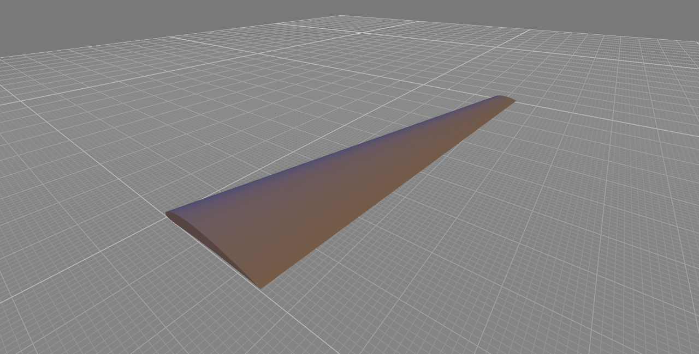

# wingstl
This project is a CLI tool for generating print-ready STL files for swept wings. An example is provided below for the output of a swept wing semi-span.



## Build Instructions
This project is structured with `include` and `src` folders, and is not dependent on any third-party libraries. To compile use:

```bash
clang -O2 -std=c99 src/*.c -Iinclude -o wingstl
```

To execute the script, add the location of the executable to your system's path and run:

```bash
wingstl
```

The output is a single STL file saved to the current directory. This file may be directly imported to slicer software for 3D printing.

## References
This project uses methods for geometry generation as described in the following references:

1. Ladson, Charles L., et al. Computer program to obtain ordinates for NACA airfoils. No. L-17509. 1996.
2. Katz, Joseph, and Allen Plotkin. Low-speed aerodynamics. Vol. 13. Cambridge university press, 2001.

## License
Licensed under the GNU General Public License v3.0 or later (GPLv3+). See License file for details.